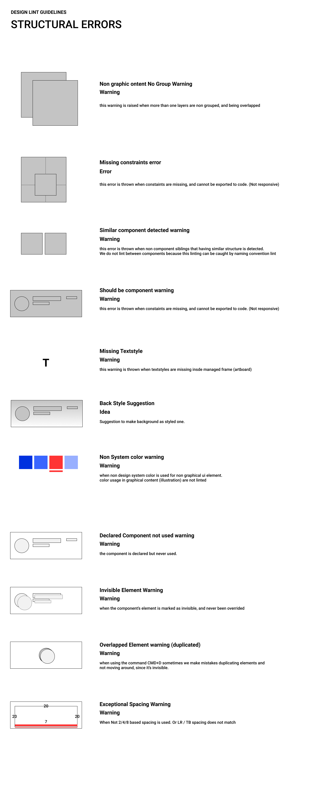

# lint
figma linting plugin & design lint engine

## Rules & Documentation
available in [figma](https://www.figma.com/file/ED6WOfsoYnnYHY8RJwU9Xw/reflect?node-id=50%3A0)

## Lints
- Structure Lint
- Visual Lint


## Features
**Basics**
- Missing textstyle (missing typography)
- Non Library color (when using non system/library colors)
- Missing Constraints (when no constraint is defined for complex layouts or components)
- Similar Components
- Case lint (when non developer-friendly naming convention is used)
  - wrong naming convention
  - name not defined
- Not used screens
- Not used components
- naming conflicts
  - screen conflict
  - component conflict
- Hidden layers warning
- Overlapped layers warning


**Visual Linting**
- aesthetic rate score
- usability & reachability score
- eye tracking score
- reference score


## Linting standards

> STRUCTURAL (the underlyign graphical resource is owned by bridged.xyz and cannot be used without referencing.)





> NAMING


> VISUAL


## References
- https://github.com/destefanis/design-lint
- https://www.figma.com/community/plugin/801195587640428208/Design-Lint
- https://lintyour.design/


> Originally forked from design-lint under MIT License


# Design Lint


Find and fix errors in your designs with Design Lint, a plugin for Figma.

[View Plugin Page](https://www.figma.com/c/plugin/801195587640428208)

Design Lint finds missing styles within your designs on all your layers. Ensure your designs are ready for development or design collaboration by fixing inconsistencies.

While it's running, Design Lint will update automatically as you fix errors. Clicking on layer will also select that layer in your design. Navigating between each error is fast and much easier than trying to find errors on your own.

## Features 

* Selecting a layer with an error will also select the layer in Figma, letting you navigate your page and fix errors with full context.
* Design Lint polls for changes and will update as you fix errors.
* "Ignore" or "Ignore All" buttons let you skip special layers.
* Use the "Select All" option to fix multiple errors at once that share the same value.
* Need to skip layers like illustrations? Locked layers in Figma will be skipped from linting.
* Custom border radius values can be set within settings and are stored in Client Storage.


Because Design Lint doesn't try and manage your library, there's no logging in, accounts, or syncing. This open source plugin is designed to make fixing errors easy and let you get back to designing. Want to write specific rules for your own organization? Feel free to fork this repo and edit to your liking!

## Install from the Figma Plugin Page

Although this plugin is open source, for most users you'll want to install from the Figma plugin community page.
[View Plugin Page](https://www.figma.com/c/plugin/801195587640428208)

## To Run Locally

* Run `yarn` to install dependencies.
* Run `yarn build:watch` to start webpack in watch mode.

### To Edit

The react code, components, and UI can be found here [App.tsx](./src/app/components/App.tsx).  
The Figma API, Storage, and Linting happens in [controller.ts](./src/plugin/controller.ts).
Linting functions and rules can be found in [lintingFunctions.ts](./src/plugin/lintingFunctions.ts).

### How the Linting Works

Different nodes (also known as layers) have different properties to lint. First we loop through the nodes the user has selected. For each layer we determine that nodes type.

```javascript
function determineType(node) {
    switch (node.type) {
      case "SLICE":
      case "GROUP": {
        // Groups styles apply to their children so we can skip this node type.
        let errors = [];
        return errors;
      }
      case "POLYGON":
      case "VECTOR":
      case "STAR":
      case "BOOLEAN_OPERATION":
      case "ELLIPSE": {
        return lintShapeRules(node);
      }
      case "FRAME": {
        return lintFrameRules(node);
      }
      case "INSTANCE":
      case "RECTANGLE": {
        return lintRectangleRules(node);
      }
      case "COMPONENT": {
        return lintComponentRules(node);
      }
      case "TEXT": {
        return lintTextRules(node);
      }
      case "LINE": {
        return lintLineRules(node);
      }
      default: {
        // Do nothing
      }
    }
  }
```

Some of these node types have the same requirements so there are generic functions that call multiple linting functions which are imported from [lintingFunctions.ts](./src/plugin/lintingFunctions.ts).

```javascript
function lintTextRules(node) {
    let errors = [];

    checkType(node, errors);
    checkFills(node, errors);
    checkEffects(node, errors);
    checkStrokes(node, errors);

    return errors;
  }
```

So for instance, this function runs the linting rules for typography, fills, effects, and strokes on this node since its a piece of text. A given node/layer can have multiple errors, which is why they're stored as an array on the node itself.

#### Changing the border radius default

If you plan on using this app as a private plugin you'll likely want to change the default border radius values which are `[0, 2, 4, 8, 16, 24, 32]`. This can be acheived by changing these values in [App.tsx](/.src/app/components/App.tsx#L23) and in [controller.ts](./src/plugin/controller.ts#L12). 

### Tooling

This repo is using:

* [Figma Plugin React Template](https://github.com/nirsky/figma-plugin-react-template)
* React + Webpack
* TypeScript
* TSLint
* Prettier precommit hook
